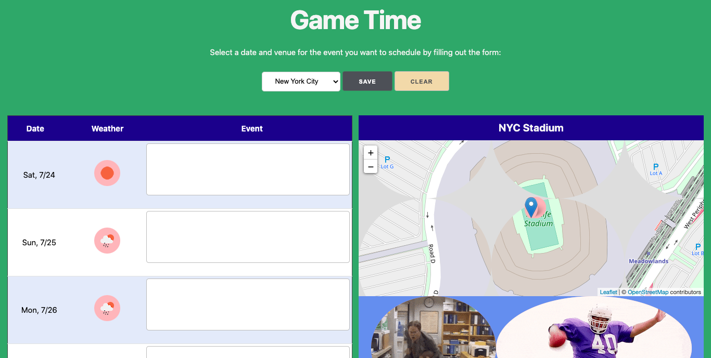

# game-time

<a href="https://varunisinha.github.io/game-time/" target="_blank">Link to website</a>

<h2>User Story: </h2>

A web application that allows the team management to schedule events based on weather conditions, a week in advance. 

<h2>Project Description: </h2>

Game Time is a web application that allows the team management to get weather predictions for a week in advance and schedule an event on the team calendar, thus informing team players of upcoming matches, practice sessions and other events. 

As soon as the team management gets on the app, they can choose a city to determine if weather conditions are conducive for play for a week in advance. 

As soon as the team management selects a city, weather emojis display for each day. The map of the venue (stadium) also pops up in the app. The team management can fill in details about the event they want to schedule against each day and save those changes to the web application.

<h2>Vision for the Future App</h2>

The current version of the web application uses the local storage on the team management’s computer. Therefore, the app will not be effective in sending updates to each team member, which is a feature we would like to introduce in the upgraded version. 

In the current version the team management will be able to make the changes to the schedule that can be broadcast on a screen in the team’s common room. However, in the upgraded version, we would like to make the app more interactive — allowing the team management and team players to exchange messages. For example, players can RSVP to events they are invited to, and the team management can mark players absent/present to track attendance.

The map functionality in the current application is cosmetic at this point in time. However, in the next version, users can get specific directions to the stadium, or information about “Things To Do” or the best places to eat near the venue. 

Also, in the current version, we just get information about general weather conditions by seeing emojis of weather predictions, such as rain, cloudy, sunshine etc. In the next version we can fetch more specific info, such as the exact temp, humidity and chances of rain. 

